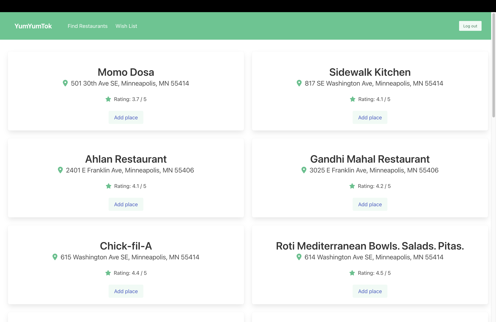

# YumYumTok

## About the project

This is a full-stack web application to keep track of your visits to restaurants. 

### Key features:
* Login for user-specific features
* Use the Google Maps API to offer a comprehensive and precise range of information about restaurants
* Utilize the location services of a user (geolocation) to be able to return restaurant suggestions near their location
* Display related search terms to help users find restaurants more easily when they enter a food-related keyword of interest
* Implement responsive design for both the mobile and web versions
* User can write a review and rate the restaurant, including its information, date of visit, and pictures
* Users can add restaurants they want to visit to their wish list, along with relevant information.

Figure 1: The sign-up and sign-in page allows users to access specific features.

Figure 2: The timeline page displays the user's reviews.

Figure 3: The search page enables users to search for restaurants or receive recommendations based on categories.

Figure 4: After searching for restaurants using keyword, the search results will be displayed. This screenshot displays the search results for restaurants after searching with the 'near me' keyword.

Figrue 5: After searching for a restaurant, users can write a review or add it to their wish list.

Figrue 6: If users are unable to find a restaurant through the search function, they can add it manually.

Figure 7: The wishlist page displays the restaurants that the user has added to their wishlist.

## Technologies

* Built with
Python, Next.js, React, NoSQL([Codehooks.io](https://codehooks.io/)), Javascript, and CSS

* External dependencies:
    * [Clerk](https://clerk.com/): User managemnet and authentication
    * [Google Maps Api](https://mapsplatform.google.com/?utm_source=search&utm_medium=googleads&utm_campaign=brand_core_exa_desk_mobile_us&gad=1&gclid=CjwKCAjwxr2iBhBJEiwAdXECw1nmUt1ONu7nYh5VrzdUvheIJCWWHBWV8rhHddX-VLNrBN4z8qG5oRoCPV8QAvD_BwE&gclsrc=aw.ds): Get a list of restaurants and their locations
    * [Gelocation Api](https://developer.mozilla.org/en-US/docs/Web/API/Geolocation_API): Access the user's location
    * [Bulma](https://bulma.io/): Styling, components
    * [Font Awesome](https://fontawesome.com/): Styling, components
    * [React Icons](https://react-icons.github.io/react-icons/): Styling, components
    

* Deployed with [Netlify](https://www.netlify.com/)

## Link to Site
<https://booktok-project2.netlify.app/>